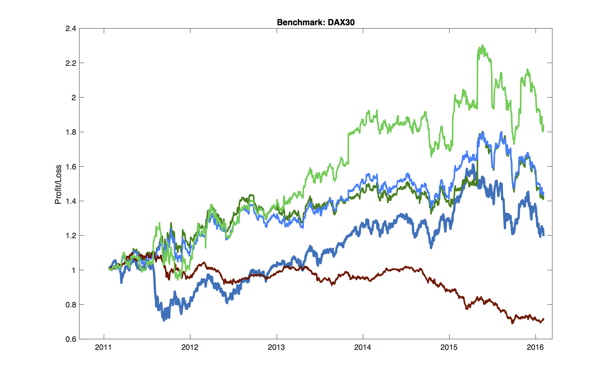
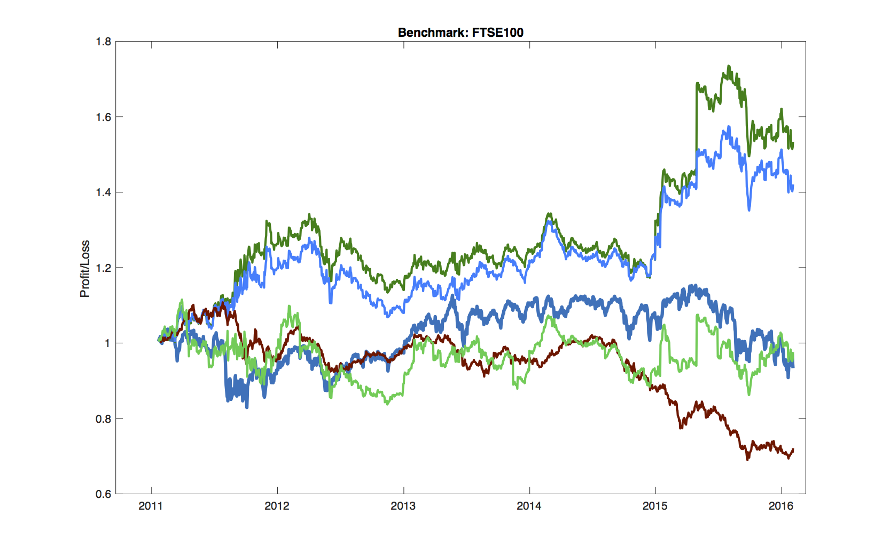
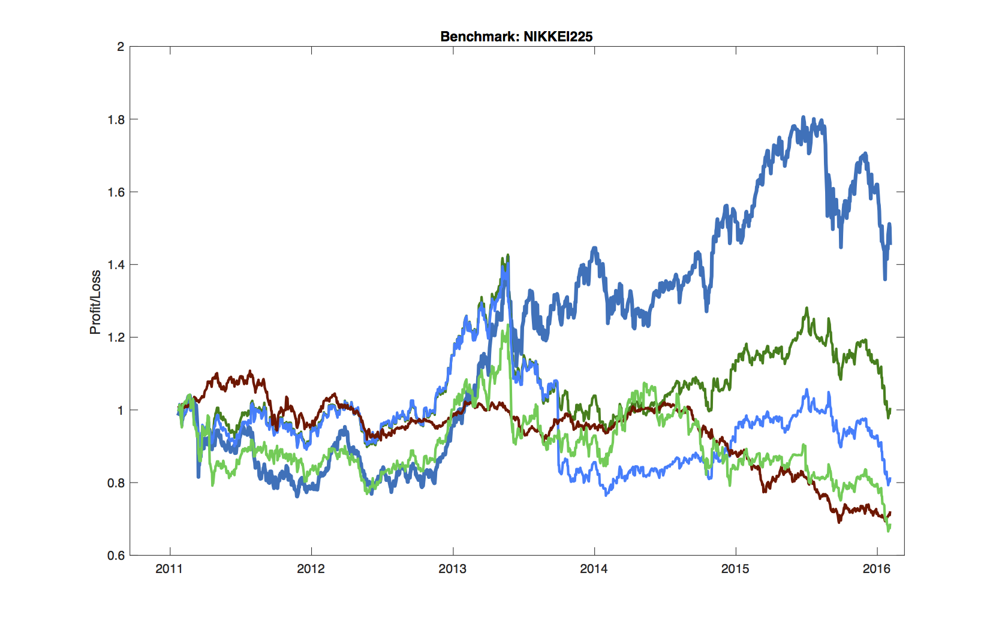
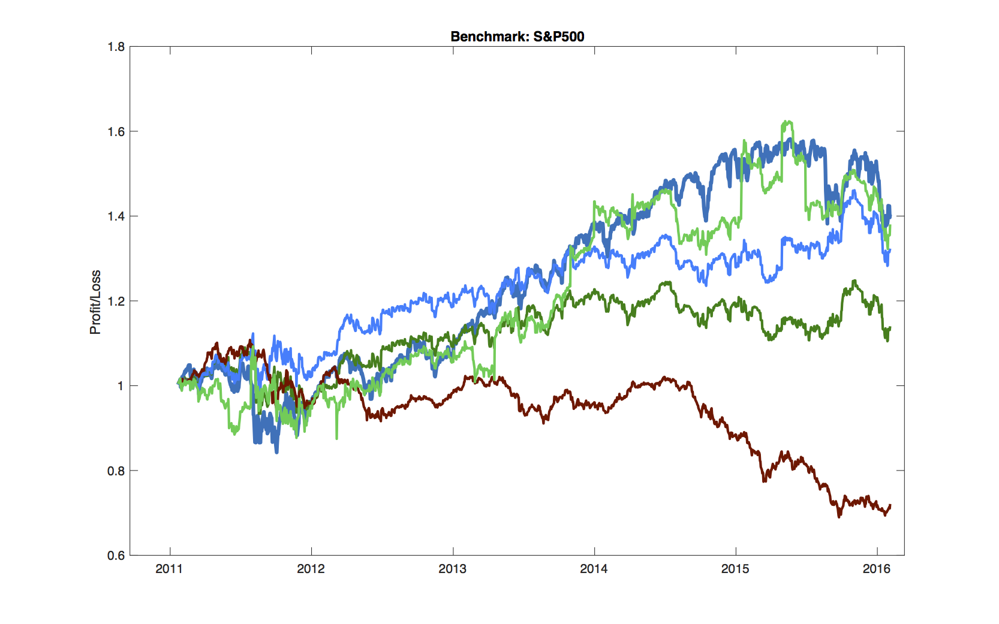
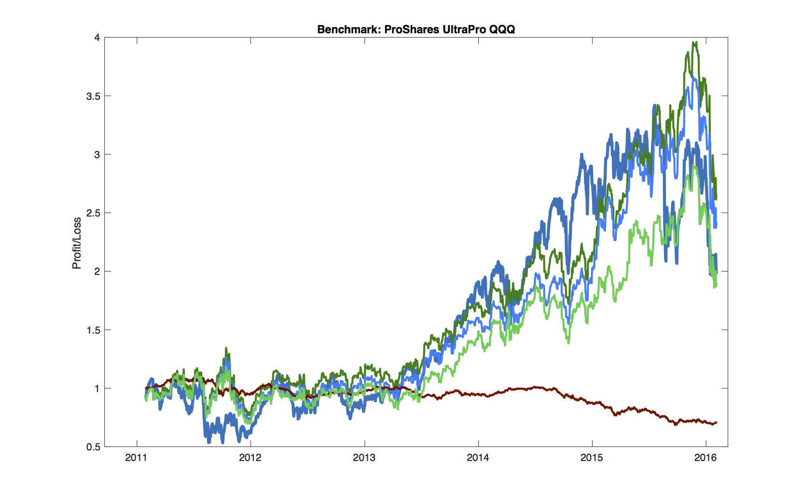
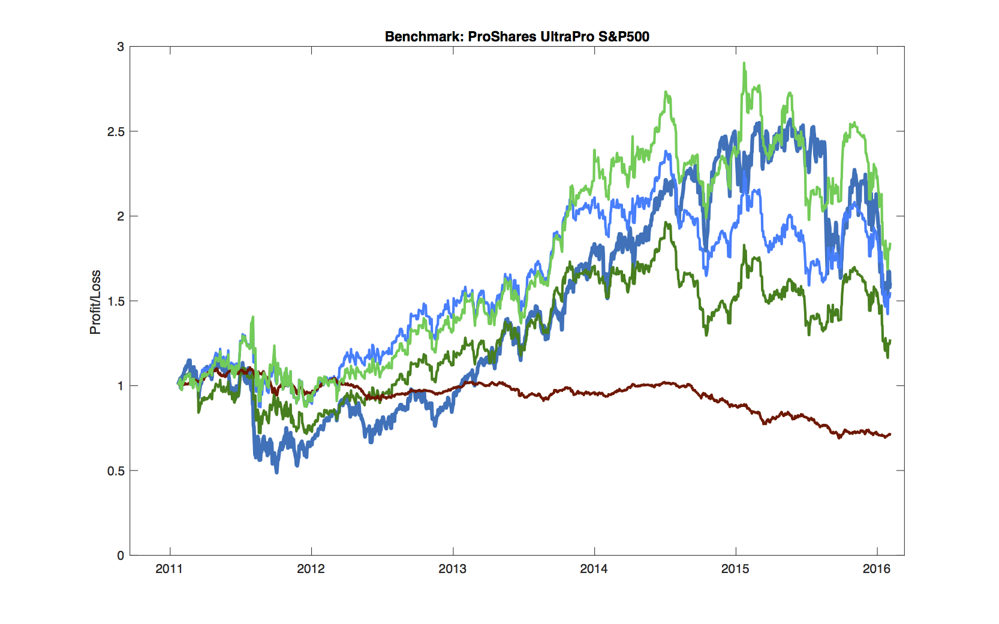

[](http://quantlet.de/)

## [](http://quantlet.de/) **TEDAS_strategies_dynamic** [](http://quantlet.de/)

```yaml

Name of QuantLet : TEDAS_strategies_dynamic

Published in : Tail Event Driven Asset Allocation

Description : 'estimates the cumulative return for 3 strategies from the TEDAS project: with
Cornish-Fisher dynamic Value-at-Risk, expected utility and risk-return allocations for daily data'

Keywords : 'L1-norm penalty, Linear programming, VaR, dynamic, kurtosis, lasso, portfolio, quantile
regression, skewness, variable selection'

See also : TEDAS_gestalts, TEDAS_perform, TEDAS_strategies2

Output : 'A plot of the three strategies cumulative return against the chosen benchmark indices
buy-and-hold and naive equal weights allocation strategies'

Author : Sergey Nasekin

Submitted : 2017/01/12

Datafile : tedas_daily_dataset_hfs_indiv.mat, highperfind.mat

Example : 'SP500 benchmark cumulative returns, NIKKEI225 benchmark cumulative returns, FTSE100
benchmark cumulative return, DAX30 benchmark cumulative return, UPRO benchmark cumulative return,
TQQQ benchmark cumulative return'

```














### MATLAB Code:
```matlab
%{
NOTE: this code requires the fastICA library
      which can be downloaded under the link:
      http://research.ics.aalto.fi/ica/fastica/
%}
clc
close all
clear

load tedas_daily_dataset_hfs_indiv 

XRET         = fundreturns; %creating covariate and response matrices
YRET         = indretmat.SP500;

%%%%%%%%Uncomment to load high-performing indices like UPRO and TQQQ%%%%%%%
% For UPRO:
%load highperfind
%XRET         = fundreturns;
%YRET         = price2ret(highperfind.UPRO);

% For TQQQ:
%load highperfind
%XRET         = fundreturns(6:end,:); 
%YRET         = price2ret(highperfind.TQQQ(6:end));
%%%%%%%%%%%%%%%%%%%%%%%%%%%%%%%%%%%%%%%%%%%%%%%%%%%%%%%%%%%%%%%%%%%%%%%%%%%

posev_ind    = [];
negev_ind    = [];
wwidth       = 250; %moving window width
wshift       = 0;
method       = 'pow3';

%VaR parameters
cl           = 0.01; 
z            = norminv(cl,0,1); %standard normal quantile for Cornish-Fisher expansion
TargRet      = 0.8; %target return quantile level
num_dig      = 4;
eta          = 10;

%Pre-allocating for the arrays to be created
clear Vcap Ccap Vcapp Ccapp Vcappp Ccappp
Vcap{wwidth}  = 1; 
Vcapp(wwidth) = 1;
Vcappp        = [];
Ccap{wwidth}  = 1; 
Ccapp(wwidth) = 1;
Ccappp        = [];
Icap{wwidth}  = 1; 
Icapp(wwidth) = 1;
Icappp        = [];
Ncap{wwidth}  = 1; 
Ncapp(wwidth) = 1;
Ncappp        = [];
Ucap{wwidth}  = 1; 
Ucapp(wwidth) = 1;
Ucappp        = [];
BETA          = [];
LAMBDA        = [];
VAR           = [];
PCOV          = [];
VWTS          = {};
CWTS          = {};
UWTS          = {};
INDEX         = {};

EXPU          = [];
RHO           = {};
ZETA          = {};
ESTP          = {};
SKKURT        = {};

% Number of simulation for Lambda estimation
numsim        = 1000;
% Open a parallel pool with a suitable number of workers
num_workers = 5;
parpool(num_workers) 
%%
%%%%Calculation of cumulative return for TEDAS and benchmark strategies%%%% 
for l = wwidth:size(XRET,1) 
    
    % Data standardization
    Y     = YRET(1+wshift:l,:);
    FUNDS = XRET(1+wshift:l,:);
    X     = FUNDS-mean(FUNDS(:));
    X     = X/std(X(:));
    [n,k] = size(X);
    
    % Negative extreme events detection
    if YRET(l) < 0
        
        tau     = round(ksdensity(Y,YRET(l),'function','cdf'),2);
        if tau == 0
            tau = round(ksdensity(Y,YRET(l),'function','cdf'),3);
        end
        
        disp('NEGATIVE EVENT')
        
        negev_ind      = [negev_ind,l];
        
        LamOpt         = LQR_lambda_sim( X, tau, numsim, wwidth );
        c              = [tau.*ones(1,n),(1-tau).*ones(1,n),LamOpt.*ones(1,k),zeros(1,k)];
        A              = [eye(n),-eye(n),zeros(n,k),X];
        A              = sparse(A);
        B              =  [-eye(k,n),zeros(k,n),zeros(k,k),zeros(k,k); 
                            zeros(k,n),-eye(k,n),zeros(k,k),zeros(k,k);
                            zeros(k,n),zeros(k,n),-eye(k,k),eye(k,k);
                            zeros(k,n),zeros(k,n),-eye(k,k),-eye(k,k)
                            zeros(k,n),zeros(k,n),zeros(k,k),eye(k,k)];
        B              = sparse(B);

        q              = [zeros(1,k),zeros(1,k),zeros(1,k),zeros(1,k),zeros(1,k)]';
        b              = Y;
        lb             = [zeros(1,n),zeros(1,n),-Inf.*ones(1,k),-Inf.*ones(1,k)];
        ub             = [Inf.*ones(1,n),Inf.*ones(1,n),Inf.*ones(1,k),zeros(1,k)];
        options        = optimoptions('linprog','Algorithm','interior-point','OptimalityTolerance',1e-6,'MaxIterations',10000);
        [bb,~,extflag] = linprog(c,B,q,A,b,lb,ub,[],options);
        beta           = bb(length(bb) - k + 1:end);
        BetaOpt        = round(beta, num_dig);
   
    else
        % Deal with positive events
        disp('POSITIVE EVENT')
        
        posev_ind = [posev_ind,l];
        Eqwts     = ones(1,k)/k;
        
        Vcap{l+1} = sum(cell2mat(Vcap(l)).*(1 + YRET(l+1)));
        Ccap{l+1} = sum(cell2mat(Ccap(l)).*(1 + YRET(l+1)));
        Icap{l+1} = sum(cell2mat(Icap(l)).*(1 + YRET(l+1)));
        Ncap{l+1} = sum(cell2mat(Ncap(l)).*Eqwts'.*(1 + XRET(l+1,:)'));
        Ucap{l+1} = sum(cell2mat(Ucap(l)).*(1 + YRET(l+1)));
        
        Vcapp     = Vcap{l+1}; 
        Ccapp     = Ccap{l+1};
        Icapp     = Icap{l+1};
        Ncapp     = Ncap{l+1};
        Ucapp     = Ucap{l+1};
        Vcappp    = [Vcappp,Vcapp];
        Ccappp    = [Ccappp,Ccapp];
        Icappp    = [Icappp,Icapp];
        Ncappp    = [Ncappp,Ncapp];
        Ucappp    = [Ucappp,Ucapp];

        % Calculate the dynamic objectives in the one-dimensional case
        count     = 0;
        err_count = 0;
        while count == err_count
            try 
            [~,F,AA,FullPar,InitPar,SigMat] = paricatvd_init(Y,method);
            catch err    
                if strcmpi(method,'pow3') == 1
                    method = 'tanh';
                elseif strcmpi(method,'tanh') == 1 
                    method = 'gauss';
                elseif strcmpi(method,'gauss') == 1
                    method = 'skew';
                elseif strcmpi(method,'skew') == 1
                    method = 'pow3';
                end
                err_count = err_count + 1;
            end
            count = count + 1;
        end
        M1 = mean(Y);
        [~,M2,M3,M4,skkurt,EstP,RhoMat,ZetaMat] = paricatvd(InitPar,SigMat,F,AA,'forecast');

        w      = 1;
        VaR    = Vcap{l}*(  - (z + ((z^2-1)*((1/((w*M2*w')^(3/2)))*((w*M3*kron(w',w'))/6))) + ( (( (1/((w*M2*w')^2))*...
            (w*M4*kron(kron(w',w'),w')) )/24) )*(z^3 - 3*z) - ( (( (1/((w*M2*w')^(3/2)))*...
            (((w*M3*kron(w',w')))) )^2)/36 )*(2*z^3 - 5*z) )*(sqrt(w*M2*w')) );
        PCoV   = M2;
        EU     =  -exp(-eta*(w*M1))*(1 + (eta^2/2)*(w*M2*w') - (eta^3/factorial(3))*...
                    (w*M3*kron(w',w')) + (eta^4/factorial(4))*(w*M4*kron(kron(w',w'),w')) );
        
        VAR    = [VAR,VaR/Vcap{l}]; %Value-at-Risk vector
        PCOV   = [PCOV,PCoV];
        BETA   = [BETA,zeros(k,1)];
        LAMBDA = [LAMBDA,0];
        VWTS   = [VWTS,0];
        CWTS   = [CWTS,0];
        UWTS   = [UWTS,0];
        INDEX  = [INDEX,0];
        %RHO    = [RHO,0];
        %ZETA   = [ZETA,0];
        %SKKURT = [SKKURT,0];
        EXPU   = [EXPU,EU];
        %ESTP   = [ESTP,0];

        fprintf('B&H     VaR     EU      Markz   Naive\n%2.3f   %2.3f   %2.3f   %2.3f   %2.3f \n',Icapp,Vcapp,Ucapp,Ccapp,Ncapp);
        
        wshift = wshift + 1;
        
        continue
        

    end
    
    %Perform portfolio value appreciation on the index if no hedge funds selected 
    if sum(BetaOpt) == 0 
        
        count     = 0;
        err_count = 0;
        while count == err_count
            try 
            [~,F,AA,FullPar,InitPar,SigMat] = paricatvd_init(Y,method);
            catch err    
                if strcmpi(method,'pow3') == 1
                    method = 'tanh';
                elseif strcmpi(method,'tanh') == 1 
                    method = 'gauss';
                elseif strcmpi(method,'gauss') == 1
                    method = 'skew';
                elseif strcmpi(method,'skew') == 1
                    method = 'pow3';
                end
                err_count = err_count + 1;
            end
            count = count + 1;
        end
        M1     = mean(Y);
        [~,M2,M3,M4,skkurt,EstP,RhoMat,ZetaMat] = paricatvd(InitPar,SigMat,F,AA,'forecast');
        w      = 1;
        VaR    = Vcap{l}*( - (z + ((z^2-1)*((1/((w*M2*w')^(3/2)))*((w*M3*kron(w',w'))/6))) + ( (( (1/((w*M2*w')^2))*...
            (w*M4*kron(kron(w',w'),w')) )/24) )*(z^3 - 3*z) - ( (( (1/((w*M2*w')^(3/2)))*...
            (((w*M3*kron(w',w')))) )^2)/36 )*(2*z^3 - 5*z) )*(sqrt(w*M2*w')) );
        PCoV   = M2;
        EU     =  -exp(-eta*(w*M1))*(1 + (eta^2/2)*(w*M2*w') - (eta^3/factorial(3))*...
                    (w*M3*kron(w',w')) + (eta^4/factorial(4))*(w*M4*kron(kron(w',w'),w')) );
        
        % Portfolio value appreciation
        Eqwts     = ones(1,k)/k;
        Vcap{l+1} = sum(cell2mat(Vcap(l)).*(1 + YRET(l+1)));
        Ccap{l+1} = sum(cell2mat(Ccap(l)).*(1 + YRET(l+1)));
        Icap{l+1} = sum(cell2mat(Icap(l)).*(1 + YRET(l+1)));
        Ncap{l+1} = sum(cell2mat(Ncap(l)).*Eqwts'.*(1 + XRET(l+1,:)'));
        Ucap{l+1} = sum(cell2mat(Ucap(l)).*(1 + YRET(l+1)));
        Vcapp     = Vcap{l+1}; 
        Ccapp     = Ccap{l+1};
        Icapp     = Icap{l+1};
        Ncapp     = Ncap{l+1};
        Ucapp     = Ucap{l+1};
        Vcappp    = [Vcappp,Vcapp];
        Ccappp    = [Ccappp,Ccapp];
        Icappp    = [Icappp,Icapp];
        Ncappp    = [Ncappp,Ncapp];
        Ucappp    = [Ucappp,Ucapp];
        
        Vwts      = 0;
        Cwts      = 0;
        Uwts      = 0;
        ind       = 0;
    else
        ind       = find(BetaOpt ~= 0);
        P         = FUNDS(:,ind);
        
        indNonNull = [];
        for i = 1:size(P,1)
            if sum(P(i,:)) ~= 0;
                indNonNull = [indNonNull,i];
            end
        end
        P  = P(indNonNull,:);
        
        
        w0 = ones(1,size(P,2))./size(P,2);
        M1 = mean(P)';
        
        count     = 0;
        err_count = 0;
        while count == err_count
            try 
            [~,F,AA,FullPar,InitPar,SigMat] = paricatvd_init(P,method);
            catch err    
                if strcmpi(method,'pow3') == 1
                    method = 'tanh';
                elseif strcmpi(method,'tanh') == 1 
                    method = 'gauss';
                elseif strcmpi(method,'gauss') == 1
                    method = 'skew';
                elseif strcmpi(method,'skew') == 1
                    method = 'pow3';
                end
                err_count = err_count + 1;
            end
            count = count + 1;
        end
        [~,M2,M3,M4,skkurt,EstP,RhoMat,ZetaMat] = paricatvd(InitPar,SigMat,F,AA,'forecast');
        
        wub     = ones(length(w0),1);
        wlb     = zeros(length(w0),1);
        Aeq     = ones(1,length(w0));
        beq     = 1;
        AA      = -M1';
        bb      = -quantile(M1,TargRet);
        Vcap{l} = sum(cell2mat(Vcap(l)));
        Ccap{l} = sum(cell2mat(Ccap(l)));
        
        %%%%%%%%%%%%%%%%%%%%%%%%%%%%%Optimization for three different objective functions%%%%%%%%%%%%%%%%%%%%%
        options     = optimoptions('fmincon','Algorithm','interior-point','TolFun',1e-6,'MaxFunEvals',10000,'MaxIter',10000);
        
        %(1): CF-VaR OPTIMIZATION
        [Vwts,VaR]  = fmincon( @(w)Vcap{l}*( w*M1 - (z + ((z^2-1)*((1/((w*M2*w')^(3/2)))*((w*M3*kron(w',w'))/6))) +...
            ( (( (1/((w*M2*w')^2))*(w*M4*kron(kron(w',w'),w')) - 3)/24) )*(z^3 - 3*z) - ( (( (1/((w*M2*w')^(3/2)))*...
            (((w*M3*kron(w',w')))) )^2)/36 )*(2*z^3 - 5*z) )*(sqrt(w*M2*w')) ),w0,AA,bb,Aeq,beq,wlb,wub,[],options );

        %(2): MARKOWITZ OPTIMIZATION
        [Cwts,PCoV] = fmincon(@(w)((sqrt(w*M2*w'))),w0,AA,bb,Aeq,beq,wlb,wub,[],options);
        
        %(3): UTILITY OPTIMIZATION
        [Uwts,EU]   = fmincon(@(w) exp(-eta*(w*M1))*(1 + (eta^2/2)*(w*M2*w') - (eta^3/factorial(3))*...
                      (w*M3*kron(w',w')) + (eta^4/factorial(4))*(w*M4*kron(kron(w',w'),w')) ),...
                      w0,AA,bb,Aeq,beq,wlb,wub,[],options);
        %%%%%%%%%%%%%%%%%%%%%%%End of optimization part%%%%%%%%%%%%%%%%%%%%
        
        Eqwts     = ones(1,length(ind))/length(ind);
        
        Vcap{l+1} = sum(cell2mat(Vcap(l)).*Vwts'.*(1 + XRET(l+1,ind)'));
        Ccap{l+1} = sum(cell2mat(Ccap(l)).*Cwts'.*(1 + XRET(l+1,ind)'));
        Icap{l+1} = sum(cell2mat(Icap(l)).*(1 + YRET(l+1)));
        Ncap{l+1} = sum(cell2mat(Ncap(l)).*Eqwts'.*(1 + XRET(l+1,ind)'));
        Ucap{l+1} = sum(cell2mat(Ucap(l)).*Uwts'.*(1 + XRET(l+1,ind)'));
        Vcapp     = Vcap{l+1}; 
        Ccapp     = Ccap{l+1};
        Icapp     = Icap{l+1};
        Ncapp     = Ncap{l+1};
        Ucapp     = Ucap{l+1};
        Vcappp    = [Vcappp,Vcapp];
        Ccappp    = [Ccappp,Ccapp];
        Icappp    = [Icappp,Icapp];
        Ncappp    = [Ncappp,Ncapp];
        Ucappp    = [Ucappp,Ucapp];
        
        fprintf('B&H     VaR     EU      Markz   Naive\n%2.3f   %2.3f   %2.3f   %2.3f   %2.3f \n',Icapp,Vcapp,Ucapp,Ccapp,Ncapp);
        
    end
    
    
    VAR    = [VAR,VaR/Vcap{l}]; %Value-at-Risk vector
    PCOV   = [PCOV,PCoV];   
    BETA   = [BETA,BetaOpt];
    LAMBDA = [LAMBDA,LamOpt];
    VWTS   = [VWTS,Vwts];
    CWTS   = [CWTS,Cwts];
    UWTS   = [CWTS,Uwts];
    INDEX  = [INDEX,ind];
    EXPU   = [EXPU,EU];
            
    wshift = wshift + 1;
    
end

%% Cumulative wealth plotting

weights      = VWTS;
dates_sample = Date(length(Date)-length(weights)+1:end);

% Plot the cumulative wealth
pfig = figure;
plot(dates_sample,Icappp,'LineWidth',3)
datetick('x')
hold on
plot(dates_sample,Vcappp,'Color',[0,127/255,0],'LineWidth',2)
plot(dates_sample,Ccappp,'Color',[0,127/255,255/255],'LineWidth',2)
plot(dates_sample,Ncappp,'Color',[127/255,17/255,0/255],'LineWidth',2)
plot(dates_sample,Ucappp,'Color',[0,204/255,77/255],'LineWidth',2)
ylabel('Profit/Loss')
title('Benchmark: S&P500') %change benchmark name
xlim('auto')
set(pfig, 'Position', [10 10 800 500])


```
